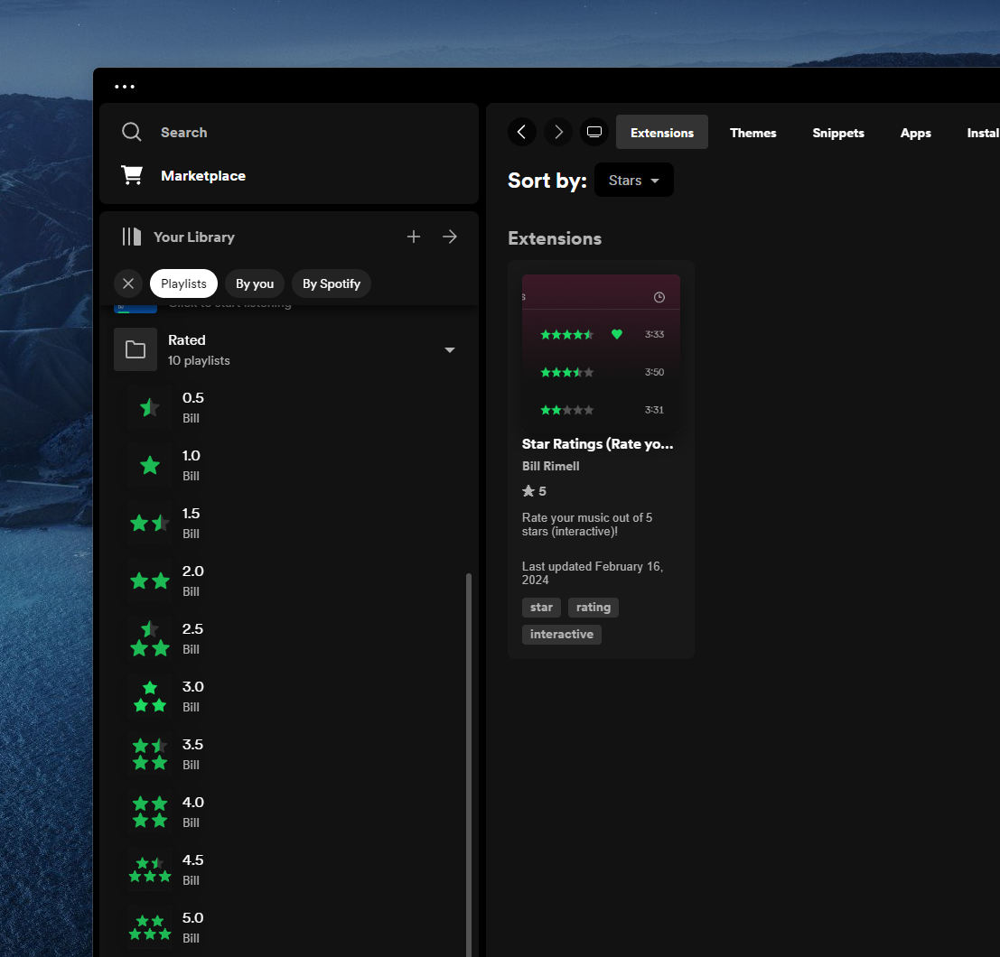

# Spicetify Star Ratings
Add star ratings to Spotify

## Install

1. Install [Spicetify](https://spicetify.app)
2. Install "Star Ratings" from the Marketplace
   

## Settings

Settings, such as enabling/disabling half star ratings, can be accessed from the menu at the top right

## Implement List

* [] option to play only unrated songs
* [] option to play songs weighted by ratings
* [] option to play songs with a minimum rating
* [] option to show rateyourmusic ratings
* [] option to upload ratings to rateyourmusic

## Star Rating Playlist Images

<table>
    <tr>
      <td></td>
      <td></td>
      <td></td>
    </tr>
    <tr>
      <td></td>
      <td></td>
      <td></td>
    </tr>
    <tr>
      <td></td>
      <td></td>
      <td></td>
    </tr>
    <tr>
      <td colspan="3"></td>
    </tr>
  </table>

 

## Credits

*Forked from [Duffey's Spicetify Star Ratings](https://github.com/duffey/spicetify-star-ratings) (archived)*

*This extension was built with [Spicetify Creator](https://github.com/spicetify/spicetify-creator)*