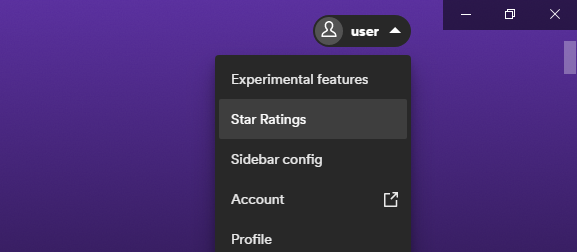
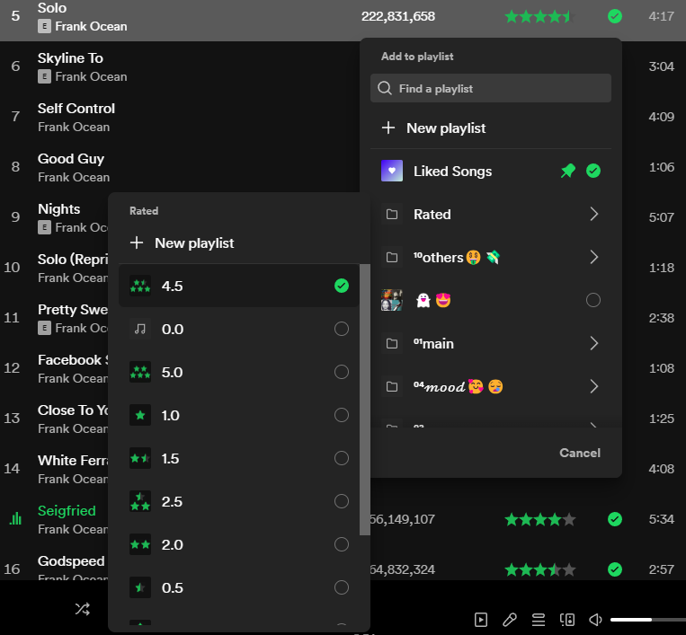

## Fork
This fork exists mostly for my changes to this project, but as the original seems to be sparsely maintained, feel free to open issues or chime in with ideas here :)

See [here](https://github.com/brimell/spicetify-star-ratings/compare/main...jullanggit:spicetify-star-ratings:main?expand=1) for changes that haven't yet made it into upstream.

## Installation
```
curl -L https://raw.githubusercontent.com/jullanggit/spicetify-star-ratings/refs/heads/main/dist/star-ratings.js \
 -o "$(spicetify path -e)/star-ratings.js" \
 && spicetify config extensions star-ratings.js \
 && spicetify backup apply
```

# Spicetify Star Ratings
Add star ratings to Spotify


## Settings

Settings, such as enabling/disabling half star ratings, can be accessed from the menu at the top right


## Implement List

- [x] option to play songs with a minimum rating
- [x] option to play only unrated songs
- [x] option to play songs weighted by ratings
- [x] configurable weighting (linear/exponential)
- [x] creating weigthed playlist
- [x] rating averaging over time
- [] option to show rateyourmusic ratings
- [] option to upload ratings to rateyourmusic (they only do albums)

## Weighted Playback
- Always keeps one weighted random track in queue.
- Workaround for remote-play issues can be enabled in the settings.

## Weighted Playlist
- Create a weighted version of a Playlist.
- Contains N random items from the original Playlist, weighted by their ratings.
- Can be used as an 'offline' weighted playback.

## Average Ratings
This has the purpose of making ratings more closely reflect your tastes;
Instead of only keeping the latest rating, every rating is recorded.
The canonical rating (used for display and random sampling) is calculated using a time-weighted average of all historical ratings.

As a safeguard and to allow ad-hoc changes of mind, any re-ratings within a five minute window behave like a non-averaged rating:
If the new rating is the same as the old one, the old rating is removed. If they are different, the new rating replaces the old one.

## Star Rating Playlist Images

<table>
    <tr>
      <td></td>
      <td></td>
      <td></td>
    </tr>
    <tr>
      <td></td>
      <td></td>
      <td></td>
    </tr>
    <tr>
      <td></td>
      <td></td>
      <td></td>
    </tr>
    <tr>
      <td></td>
      <td colspan="3"></td>
    </tr>
  </table>

<br>

# Playlist Icons Recommendation

https://github.com/jeroentvb/spicetify-playlist-icons provides a nice view of the playlist icons when you are adding to them manually 

## Credits

*Forked from [brimell's Spicetify Star Ratings](https://github.com/brimell/spicetify-star-ratings)*

*Forked from [Duffey's Spicetify Star Ratings](https://github.com/duffey/spicetify-star-ratings) (archived)*

*This extension was built with [Spicetify Creator](https://github.com/spicetify/spicetify-creator)*
